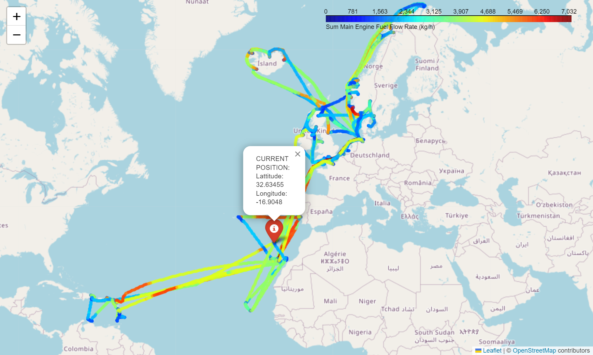

# Analysis of Cruise Ship Data Towards Performance Trends

The goal of this project is to analyze the provided dataset for two Cruise ships and develop a narrative explaining the performance trends (e.g.: efficiency, propulsion, power generation, etc.).

# Remarks (PLEASE READ)
Unfortunately, I'm very busy at the moment and had to ignore the important aspects listed in the "To-Do and Improvements for Next Time" section. The data are super-interesting and I have a lot of ideas. Moreover, I would present the results on a web-UI (with Dash and Django), e.g. as shown here: <br>
https://dash.gallery/dash-opioid-epidemic/ <br>
I have already done that in my last job...Hope, that the here presented work is still sufficient for a personal conversation, looking forward to hearing from you.

# Table of Contents

<!-- TOC -->

- [Analysis of Cruise Ship Data Towards Performance Trends](#analysis-of-cruise-ship-data-towards-performance-trends)
- [Remarks (PLEASE READ)](#remarks-please-read)
- [Table of Contents](#table-of-contents)
- [Installation / Usage](#installation--usage)
- [Folder-Order](#folder-order)
- [To-Do and Improvements for Next Time](#to-do-and-improvements-for-next-time)
- [Analysis Example](#analysis-example)
- [Contributions](#contributions)
- [Acknowledgments](#acknowledgments)

<!-- /TOC -->

# Installation / Usage
- start the main.ipynb script in the src-subfolder

# Folder Structure
```
|   .gitignore                        <-- file-list ignored by github
|   README.md                         <-- readme-overview
|
+---data
|       data.csv                      <-- raw data
|
+---docs
|       schema.pdf                    <-- scheme send by TUI
|       task_description.pdf          <-- task send by TUI
|
+---src
    |   .env                          <-- constants for processing (paths etc.)
    |   main.ipynb                    <-- main, notebook for analysis
    |
    \---tui_cruises_data_science
        |   data_conversion.py        <-- conversion of data (to SI units etc.)
        |   data_reader.py            <-- data-reader class
        |   data_visualization.py     <-- visualization class
        |   styling.py                <-- minor styling specifications
        |   __init__.py               <-- class embedding as py-module
```

# To-Do and Improvements for Next Time
- "responsible" data processing:
  - handling of NaNs, duplicates and missing data
  - conversion of all numbers into SI-units
  - Development of meaningful physical measurement parameters (forces in N, calculation of frictional forces, etc.)
- machine learning on vessel-features with scikit-learn
- transfer Data to SQL-DB (respecting 3.5 normal forms)
- working with Python-venv in order to extract a requirements.txt-file
- data visualization with Web-UI (Django or Dash, example: https://dash.gallery/dash-opioid-epidemic/)
- dockerization of an equivalent main.py, exposing web-UI to intranet of TUI company
- improved branch-management and connection to Kanban-board (agiles management)
- improved object-oriented structure (classes, subclasses, modules)
- sustainable coding (markdown-description, improved commit-messages, comments in code etc.)

# Analysis Example


# Contributions
This project has only one contributer, who is the applicant himself.

# Acknowledgments
Data obtained from TUI Cruises GmbH in context of an application for an internship as a data scientist.
